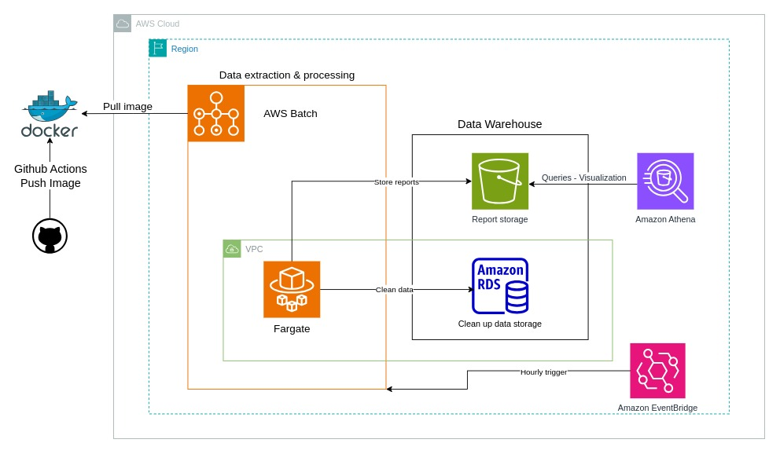

[](https://github.com/vkarapatsias/data-eng-project/actions/workflows/main.yml) 

# Schiphol Airport ETL Tool

## Description
The Schiphol Airport ETL Tool is designed to process and analyze airline data provided by the Schiphol Airport API. Using flight data from the API, the tool provides reports for airlines, destinations, and airport's busiest facilities (gates, terminals etc). The processed results can be utilized by an application that will inform travellers about congestion in the airport and help them better plan their travel, taking into consideration how busy the terminal they depart is or estimate the waiting time after landing to the airport. 

The solution can be deployed locally as well as in the AWS cloud environment.

### Disclaimers
As for now the app is compatible with data model `version 4` of Schiphol airport API.

### Purpose
The primary purpose of this ETL tool is to:
- Extract data from the Schiphol Airport API.
- Transform the data into a usable format for analysis.
- Load the data into a database and S3 for storage and further processing.
- Generate reports to provide insights into airline operations, destinations, and trends, that then can be imported in visualization tools.

### Core features
 - **Data extraction module**: extracts raw data from the Schiphol API.
 - **Data processing module**: separates the arrivals from the departures from the raw data, cleans any incomplete entries and provide analytics and metrics based on them.
 - **Data storage module**: stores the cleaned up data on a user specified database in four tables:
    - ARRIVALS
    - DEPARTURES
    - ARRIVALS_DESTINATIONS
    - DEPARTURES_DESTINATIONS
 - **AWS manager module**: stores the generated reports in a designated S3 bucket.
 
 The last module enables visualization of the results through **Amazon Athena** and **Amazon QuickcSight**, as well as keeping a record history of the data.


### Repo architecture
```
├── .github
│   └── main.yaml
├── config
│   ├── config.py
│   ├── __init__.py
│   └── logging_config.py
├── docker-compose.yaml
├── Dockerfile
├── LICENSE
├── logs
├── main.py
├── Makefile
├── modules
│   ├── aws_handler.py
│   ├── database_handler.py
│   ├── data_fetching.py
│   ├── data_processing.py
│   ├── etl_controller.py
│   └── __init__.py
├── README.md
├── requirements.txt
├── sql
│   └── create_tables.sql
└── tests
    ├── test_app.sh
    ├── test_data_fetching.py
    └── test_files
        └── data.json
```

## How to execute
### Setup
1. **Clone the repository**:
    ```bash
    git clone https://github.com/your-username/schiphol-etl-tool.git
    cd schiphol-etl-tool
    ```
    Dependencies are automatically installed when the app is executed, both inside the Docker container, as well as outside. In the second scenario, a virtual environment is set up and the dependencies are installed in it.

2. **Set up environment variables**:
    A set of environment variables is required when one tries to execute the app. 
    ```
    # SCHIPHOL API 
    SCHIPHOL_API_APP_ID=your_schiphol_api_app_id
    SCHIPHOL_API_APP_KEY=your_schiphol_api_app_key

    # DATABASE
    DB_USER=your_db_username
    DB_PASSWORD=your_db_password
    DB_NAME=SCHIPHOL_AIRPORT_DB
    DB_PREFIX=postgresql
    DB_IP_ADDRESS=your_db_ip_address

    # AWS
    AWS_ACCESS_KEY_ID=your_aws_access_key <required for local deployments>
    AWS_SECRET_ACCESS_KEY=your_aws_secret_key <required for local deployments>
    S3_BUCKET_NAME=your_s3_bucket_name

    # MISC
    DATA_WINDOW_HOURS=time_window_in_hours <optional>
    ```

4. **Docker setup**:
    Do setup the project using Docker, ensure Docker is installed in your system and run:
    ```
    docker build -t mpilas/etl_service:latest .
    ```
    to build the image. Next set up the containerized postgresql database. In case an external database is used, please skip this step.
    ```
    docker-compose up -d
    ```
    
### Execution
#### Local deployment
The app can be initiated locally either by running the docker container
```
 docker run -p 5000:5000 \
    --network=app-network \
    -e <ENV_VAR>=<value> \
    ...
    -e <ENV_VAR>=<value> \
    etl_service

```
**<ENV_VAR>** are defined above. You can also use the Makefile and run:

 ```
  <set_up_the_env_variables> make
 ```

#### AWS deployment
##### Architecture

<div style="text-align: center;">
    
</div>

##### Operational cost calculation
The architecture was deployed in `eu-central-1` Region (Frankfurt) for reduced latency.
- AWS Batch - Fargate:
    - task duration: ~1minute * 24 times per day
    - vCPU: 1
    - memory: 2GB
    - cost per month: 0.68136 \$/month
- AWS Secrets Manager: 0.40\$ per secret per month, 1.6\$ per month for the 4 secrets used: DB and Schiphol API credentials. 
- Data warehouse:
    - Standard S3 bucket: ~0 due to small size of data files (file size 600-700 Bytes). Estimated <2.5MB per month so the cost and the monthly expenses for the bucket are 0\$.0245 per GB
    - RDS :
        - singleAZ
        - no read replicas
        - db.t4g.micro	(\$0.019/hour): 13.68\$
        - 20GB storage (\$0.137 per GB-month): 2.74\$
        - cost: 16.42\$/month
- Amazon Athena: 5$ per TB of SQL query (during a month's period report files won't reach that size), assuming 100GB of SQL queries per month the cost would \$0.5
- EventBridge: used AWS default service events which are free

**Total costs:** 19.2 \$/month

##### Development costs:
An EC2 instance will be required to access the RDS database which will add up to the total costs, based on the instance type and the uptime.

## Future improvements
 - Features:
    - Pair the application with a UI that can easily visualize the reports or/and the cleaned data
 - Code:
    - parallel processing of the data
 - AWS:
    - Use Terraform to manage and provision all the resources.
    - Increase availability by deploying a multi-AZ RDS.
    - Improve performance by adding RDS read replicas.
    - Define a lifecycle policy on the data in the S3 bucket.
    - Use Amazon Glue between the Amazon S3 and Amazon Athena.

## Contact
For any questions or inquiries regarding this application, please contact me at kvassilis047@gmail.com .